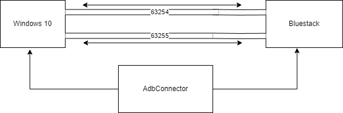
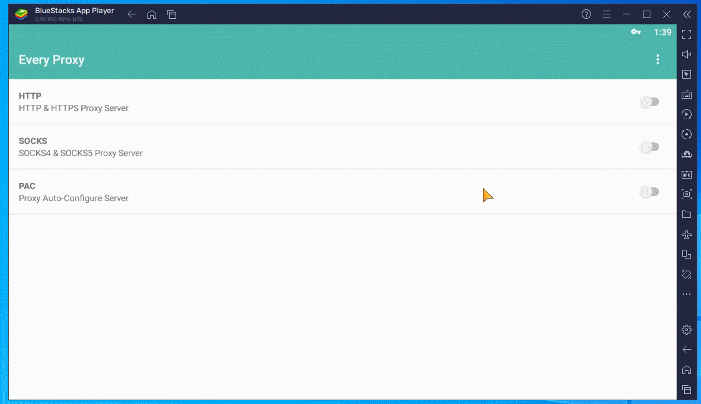

<h2>⭐Use android VPN for Windows 10!⭐</h2>

<h1>how to use :</h1> 
<h3>step 1 :</h3> 
Download this two files  
1. <a href="https://github.com/Alireza-Ghavabesh/adb/files/13185843/AdbConnector.zip">AdbConnector.zip</a> 
2. <a href="https://github.com/Alireza-Ghavabesh/adb/files/13185843/AdbConnector.zip">adb-setup-1.4.3.zip</a> 
<h3>step 2 :</h3>
<b>→</b> extract <b> AdbConnector.zip</b>  and copy <b>AdbConnector.exe</b> to this path: 
<b>C:\ProgramData\Microsoft\Windows\Start Menu\Programs\StartUp</b>   

<b>→</b> extract <b>adb-setup-1.4.3.zip</b> and install <b>adb-setup-1.4.3.exe</b>

<h3>step 3:</h3>
→ <b>Restart PC</b>
<h3>step 4:</h3>
→ install <b>EveryProxy android app</b> into <b>bluestack</b> 
→ in everyproxy go to settings and change <b>IP Address</b> to 0.0.0.0  
→ in everyproxy settings, for HTTP change port to <b>63254</b>  
→ in everyproxy settings, for SOCKS change port to <b>63255</b>  

<h3>step 5 :</h3>
→ Enable http proxy in everyproxy app and Now in windows 10 go to <b>proxy settings</b> and use proxy:  
IP Address: 127.0.0.1  
Port: 63254  
  

if you have apps like Nekoray or any app that support socks proxy, you can use <b>127.0.0.1:63255</b>  

<h1>⚠ Important note: </h1>

only if you want use nekoray Tun mode (VPN mode), you have to do this : 

<b>→</b> in Nekoray app go to tab <b>Preferences</b> -> <b>Tun settings</b> -> in <b>Bypass Process Name</b> window, put this two line and press ok :  
HD-Player.exe 
AdbConnector.exe 

⭐ This will prevent from connection loop between windows and bluestack!

<h1>Enjoy!</h1>
